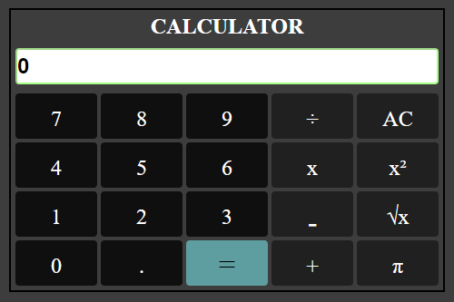

# EXCERCISE: MAKE A PROGRAM TO CALCULATE

This is a solution to improve my coding skills by building realistic projects. 

## Table of contents

- [Overview](#overview)
  - [The challenge](#the-challenge)
  - [Screenshot](#screenshot)
  - [Links](#links)
- [My process](#my-process)
  - [Built with](#built-with)
  - [What I learned](#what-i-learned)
  - [Continued development](#continued-development)
- [Author](#author)

## Overview

### The challenge
While I was practicing javascript  I found online some excercises and this project caught my attention.

This little project for beginners try to focus in basic designs to improve and apply knowledge of html, css and javscript.
Users should be able to:

### Screenshot

### Links

- Solution URL: [Github](https://github.com/misaeljoelp/calculator )
- Live Site URL: [Github pages](https://misaeljoelp.github.io/calculator/calculator.html)

## My process

### Built with

- Semantic HTML5 markup
- CSS custom properties

### What I learned
The interesting thing is that I learned that I should not stop practicing since much knowledge can easily fall into oblivion.
Recordé algunos conceptos de grid, math operations.
To see how you can add code snippets, see below:

### Continued development

I would like practice more projects with grid applications.

## Author

- Frontend Mentor - [@misaeljoelp](https://www.frontendmentor.io/profile/misaeljoelp)
- Twitter - [@MyJolyPeVa](https://www.twitter.com/MyJolyPeVa)

